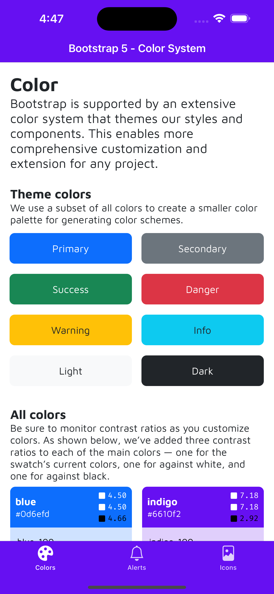
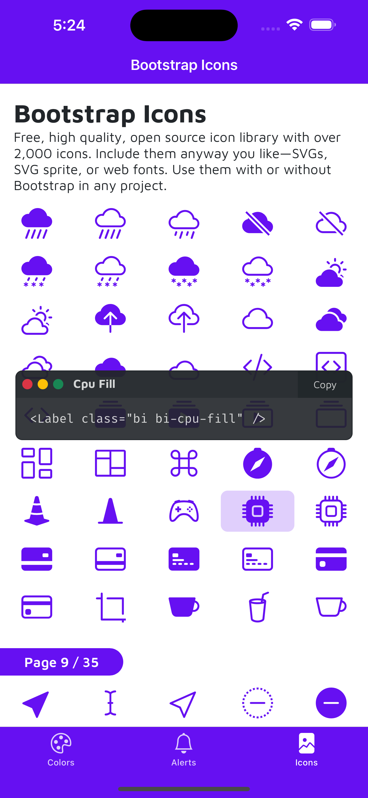

# BT5 Colors in PurgeTSS

## Overview

### Color System

This Sample App demonstrates the ease of creating a custom color palette for your [Titanium](https://titaniumsdk.com) mobile application using [PurgeTSS](https://purgetss.com).

We've created a custom color palette inspired by Bootstrap 5 colors and showcased it within the app. This project aims to highlight how simple it is to work with and recreate a personalized color palette using PurgeTSS.

<p align="center" width="100%">

</p>

## Getting Started

First, make sure you have **PurgeTSS** installed globally on your machine:
```bash
> npm i -g purgetss
```

To get started with this Sample App and explore the custom color palette, follow these steps:

1. Clone this repository to your local machine:

   ```shell
   git clone git@github.com:macCesar/Bootstrap-5-Colors-in-PurgeTSS.git
   ```

2. Install the necessary dependencies for your Titanium project.

3. Open the project in your preferred code editor or IDE.

4. Explore the color palette configurations in `purgetss/config.js` to understand how the custom color palette is implemented.

5. Run the app on your simulator or device to see the custom color palette in action.

6. You can copy the `config.js` file to your Titanium project to use the custom color palette in your app.


## Bootstrap Icons

A free, high-quality, open-source icon library with over 2,000 icons. The original Bootstrap Icons are available in SVGs, SVG sprites, and web fonts.

**We've converted the original `.woff` font file to `.ttf` for use in any Titanium mobile app.**

Here's the [Font File](app/assets/fonts/bootstrap-icons.ttf), the [Styles file](purgetss/styles/fonts.tss), and the [Commond-JS](app/lib/purgetss.fonts.js) file.

In the `Icons` tab, click on any of the icons to view an example code and see the class name.

<p align="center" width="100%">

</p>


## Resources

- [Bootstrap 5 Color Palette Documentation](https://getbootstrap.com/docs/5.2/customize/color/) - Refer to Bootstrap 5 documentation for additional information on theme colors.
- [Bootstrap Icons](https://icons.getbootstrap.com) - Free, high quality, open source icon library with over 2,000 icons.

## Contributing

If you'd like to contribute to this Sample App or have suggestions for improvements, please feel free to open an issue or submit a pull request.

## License

This Sample App is open-source and available under the [MIT License](LICENSE).
